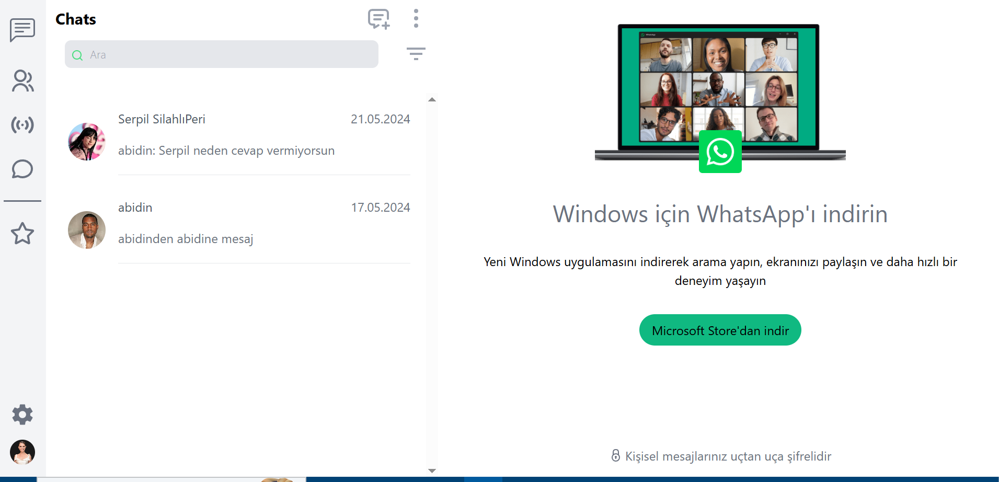
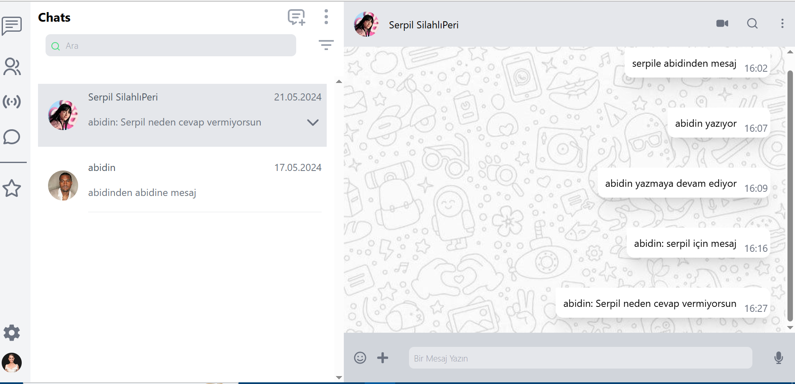
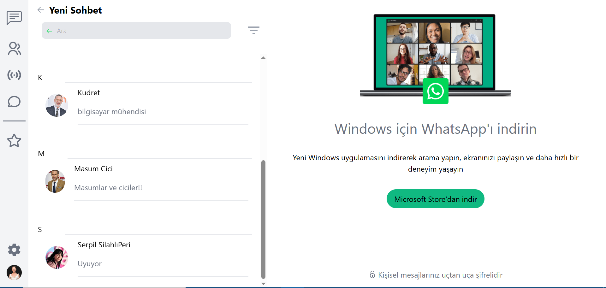

# wpClone
wpCloneWtailwind

Frontend kısmında ;
React, Tailwind css kullandım. Global state yönetimi için Zustand tercih ettim, ikonlar için ise react-icons kütüphanesini kullandım. 
Backend kısmında; nodejs ve socket yapısını kullandım.
Veri tabanı olarak ise firebase firestore-database kullandım. 
Proje devam ediyor.

At the front end;
React uses Tailwind css. You chose Zustand for global state management, and expanded the react-icons library for icons.
At the rear end; run nodejs and socket.
As a database, firebase firestore-database solutions.
The project continues.

